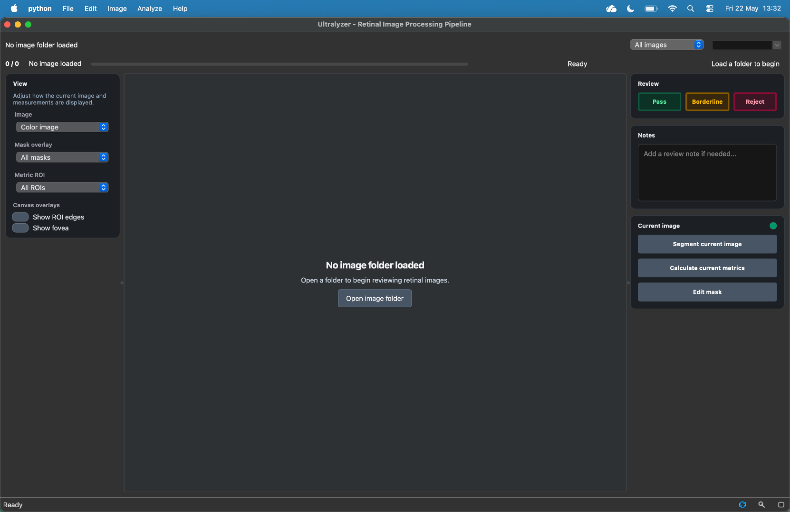

# Interface Tour

This page explains the current Ultralyzer interface as it appears in the desktop application. The descriptions below match the labels defined in the live GUI, so they should line up with what you see in the window.

## Window structure

The main window is organized into five areas:

1. A **top navigation row** for dataset context and quick image selection.
2. A **menu bar** for global actions such as import, export, batch processing, and help.
3. A **left view sidebar** for image, mask, and ROI display controls.
4. A **central canvas** for image inspection and mask editing.
5. A **right workflow sidebar** that switches between review mode and edit mode.

At the very bottom, the **status bar** also includes compact utility controls for refresh, zoom, and mask opacity.

## Top navigation row

The top row helps you stay oriented inside a dataset:

- **Folder label**: shows the currently loaded image folder.
- **Image filter**: lets you narrow the list to `All images`, `Unreviewed`, `No segmentation`, `No metrics`, or `Rejected`.
- **Image dropdown**: a searchable selector that jumps directly to a file by name.

This row is designed for rapid movement through large image sets without opening secondary dialogs.

## Menu bar

The menu bar exposes the full application workflow.

### File

- **Open Image Folder...** loads the image directory.
- **Load Segmentation Folder...** imports an existing folder of segmentation masks.
- **Import > PSD Segmentations...** ingests layered PSD masks.
- **Import > DICOM Images...** converts DICOM images into the current project.
- **Export > Results Workbook...** writes the workbook of metrics and QC results.
- **Export > PSD Segmentations > Current Image...** exports a PSD for the current image.
- **Export > PSD Segmentations > All Images...** exports PSD files for all loaded images.

### Edit

- **Undo** and **Redo** apply to mask editing.
- **Save Edits** writes the current mask to disk.
- **Reset Edits** restores the saved version of the current mask.

### Image

- **Previous Image** and **Next Image** move through the filtered image list.
- **Refresh Current Image** reloads the current image and mask from disk.
- **View > Fit to Window**, **Actual Size**, and **Center Image** control canvas presentation.
- **Assign QC to All** bulk-applies `Pass`, `Borderline`, or `Reject` to the loaded image set.

### Analyze

- **Current Image > Segment** runs segmentation for the current image.
- **Current Image > Calculate Metrics** runs metric calculation for the current image.
- **Pending Images > Segment Pending Images** processes the remaining eligible images.
- **Pending Images > Calculate Pending Metrics** calculates metrics for the remaining eligible images.
- **Advanced Segmentation > A/V Segment** and **Disc Segment** run targeted segmentation tasks.

### Help

- **Metric Definitions** opens the reference material for metric names and meanings.
- **About Ultralyzer** shows version and application information.

## Left view sidebar

The left sidebar controls what you see on the canvas.

### Image

The **Image** dropdown switches the displayed source view between:

- `Color image`
- `Red channel`
- `Green channel`
- `Blue channel`

### Mask overlay

The **Mask overlay** dropdown switches the visible segmentation layer:

- `Arteries`
- `Optic disc`
- `Veins`
- `All vessels`
- `All masks`
- `No mask`

### Metric ROI

The **Metric ROI** selector controls which region definitions are used for ROI-dependent metrics and outline display. The default ROI definitions currently exposed by the application are:

- `Full image`
- `Central retina`
- `Mid-periphery`

The current selection is also used when ROI outlines are shown on the canvas.

### Canvas overlays

- **Show ROI edges** toggles display of ROI outlines.
- **Show fovea** toggles the fovea marker when a fovea location exists.

## Central canvas

The canvas is the main inspection and editing area.

- The retinal image is shown in the selected image view.
- Segmentation masks are overlaid in color on top of the image.
- Zoom and pan are supported.
- In edit mode, the canvas responds to painting, erasing, vessel reclassification, and fovea placement tools.

The standard segmentation colors are:

- Arteries in red
- Optic disc in green
- Veins in blue

## Right workflow sidebar

The right sidebar changes depending on whether you are reviewing the image or editing its mask.

### Review mode

Review mode contains three cards.

#### Review

The **Review** card exposes the QC decisions:

- **Pass**
- **Borderline**
- **Reject**

These decisions drive which images are considered eligible for batch processing.

#### Notes

The **Notes** card provides a free-text field for image-specific comments.

#### Current image

The **Current image** card contains the main single-image actions:

- **Segment current image**
- **Calculate current metrics**
- **Edit mask**

It also includes the geometry readiness indicator.

:::{note}
The geometry readiness indicator is a small traffic-light dot shown in the header of the **Current image** card.

- `Green` means the required geometry operations are available.
- `Yellow` means only part of the geometry workflow is available, so some geometry-dependent metrics may be skipped.
- `Red` means geometry-dependent metrics are unavailable and will be skipped.

Hover over the dot to see the current readiness summary.
:::

### Edit mode

When you click **Edit mask**, the workflow sidebar switches into edit mode.

#### Mask editing

This card shows the **Exit edit mode** button and reminds you that the Edit menu and keyboard shortcuts are available for save, undo, redo, and reset.

#### Tools

The **Tools** card exposes the mask editing toolbar:

- **Brush** for manual painting
- **Smart paint** for assisted vessel painting
- **Eraser** for removing mask regions
- **Swap** for changing artery versus vein assignment
- **Fovea location** for setting the fovea marker
- **Brush size** slider for tool radius control

## Status bar utilities

The status bar is not only for text messages. It also includes three compact controls:

- **Refresh** button to reload the current image and mask
- **Zoom** button with `Fit`, `100%`, and `Center` options
- **Opacity** popover with a slider for mask transparency

These controls mirror common display tasks without forcing you back into the menu bar.

## Practical reading of the interface

If you are learning the GUI for the first time, use this order:

1. Load a folder and inspect the top navigation row.
2. Use the left sidebar to change channels, overlays, and ROI display.
3. Use the right sidebar to review or edit the current image.
4. Use the status bar when you need quick display adjustments.
5. Use the menu bar for import, export, advanced segmentation, and batch actions.
