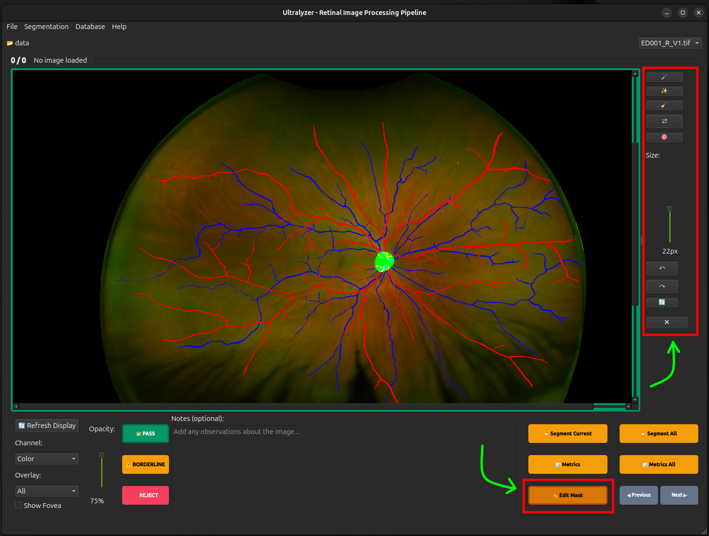

# GUI Explained

## What is Ultralyzer?

Ultralyzer is a specialized software application designed for the processing, segmentation, and analysis of retinal UltraWidefield (UWF) images. It provides a streamlined pipeline to load image datasets, quality control images, perform automated segmentation of retinal structures (arteries, veins, optic disc, fovea), edit segmentation and export comprehensive vascular metrics.

Ultralyzer should be compatible with Linux, Windows, and MacOS systems that support Python 3.12 (tested) or higher and have the required dependencies installed. Testing of the app has been carried out on Linux and MacOS devices.

## Overview

The Graphical User Interface (GUI) is divided into a main window that handles global actions (loading files, exporting data) and a central workspace dedicated to the interactive processing of images. The layout is designed to facilitate a rapid review workflow, allowing users to navigate through large datasets efficiently while correcting segmentation errors on the fly.

## Main Components

### 1. Menu Bar

Located at the very top of the window, the menu bar organizes global application commands:

* **File**:
  * **Open Image Folder...**: Select the root directory containing your retinal images.
  * **Load Segmentation Folder...**: Load pre-computed segmentation masks (e.g., from external models) to match with currently loaded images.
  * **Import**: Import PSD segmentations or convert DICOM images.
  * **Export**: Export the results workbook or layered PSD segmentations.
* **Edit**:
  * **Undo / Redo**: Revert or re-apply recent segmentation edits.
  * **Save Edits**: Saves the current segmentation mask to disk.
  * **Reset Edits**: Restores the current mask from disk.
* **Image**:
  * **Previous Image / Next Image**: Navigate through the loaded image list.
  * **Refresh Current Image**: Reload the current image and mask from disk.
  * **View**: Fit, center, or display the image at actual size.
  * **Assign QC to All**: Bulk assign a quality control decision (`PASS`, `BORDERLINE`, `REJECT`) to all loaded images.
* **Analyze**:
  * **Current Image**: Segment the current image or calculate its metrics.
  * **Pending Images**: Segment or calculate metrics for pending images.
  * **Advanced Segmentation**: Run specific Artery/Vein or Optic Disc segmentation tasks.
* **Help**:
  * **Metric Definitions**: Opens a reference guide explaining all the metric terms.
  * **About**: Version and copyright information.

### 2. Top Navigation Bar

Immediately below the menu bar, this area provides context about the current dataset:

* **Folder Label**: Displays the name of the currently loaded image directory.
* **Image Dropdown**: A searchable combo box allowing you to jump directly to a specific image file by name.

### 3. The Workspace (Central View)

This is the heart of the application, split into the Image Canvas and the Control Panel.

#### A. Image Canvas

The large area displaying the retinal image and segmentation mask.

* **Interaction**: Supports zooming and panning.
* **Overlays**: Displays segmentation masks (Arteries in Red, Veins in Blue, Optic Disc in Green) on top of the original image.

#### B. Edit Toolbar (Hidden by default)

Appears on the right side of the canvas when **"✏️ Edit Mask"** is clicked. It contains tools for manual correction. A deep-dive into how to use these tools will be available soon as part of the documentation:

* **🖌️ Brush**: Manually paint on the overlay (`Ctrl+B`).
* **✨ Smart Paint**: Semi-automated tool that snaps to vessel edges (`Ctrl+Shift+B`).
* **🧹 Eraser**: Remove incorrect segmentation areas (`Ctrl+E`).
* **⇄ Color Switch**: Click a vessel to toggle its classification between Artery and Vein (`Ctrl+C`).
* **🎯 Fovea Location**: Manually place the fovea center point.
* **Size Slider**: Adjusts the diameter of the brush/eraser tools (`+` / `-` keys or `Shift + Scroll`).
* **Undo/Redo**: Revert or re-apply changes (`Ctrl+Z` / `Ctrl+Shift+Z`).

### 4. Control Panel (Bottom Section)

The bottom area is divided into four functional groups:

#### Display Controls (Left)

* **Overlay Dropdown**: Filter what is shown on the canvas (e.g., "Vessels Only", "Red Channel", "All").
* **Show Fovea**: Toggle the visibility of the fovea marker if available.
* **Opacity Slider**: Adjust the transparency of the segmentation overlay against the raw image (`Ctrl + Scroll`).

#### Quality Control (Middle-Left)

Used to grade the quality for the current image, not the segmentation overlay. The user can assign one of three quality grades:

* **✅ PASS**: Image is of good quality for analysis.
* **⚠️ BORDERLINE**: Usable but contains minor issues.
* **❌ REJECT**: Image is unsuitable for analysis.

The app also provides a text field for adding specific comments about the image/participant (acquisition details, medication, etc.).

* **Notes**: A text field for adding specific comments about the image/participant.

#### Processing Actions (Middle-Right)

* **⏩ Segment Current**: Runs the AI model on the currently visible image.
* **📊 Metrics**: Calculates vascular metrics for the current image (requires a valid segmentation).
* **✏️ Edit Mask**: Toggles the **Edit Toolbar** to allow manual corrections.

#### Batch & Navigation (Right)

* **⏩ Segment All**: Batch segments all "PASS" or "BORDERLINE" images.
* **📊 Metrics All**: Batch calculates metrics for all "PASS" or "BORDERLINE" images.
* **◀ Previous / Next ▶**: Navigates through the dataset (`Left` / `Right` arrow keys).
