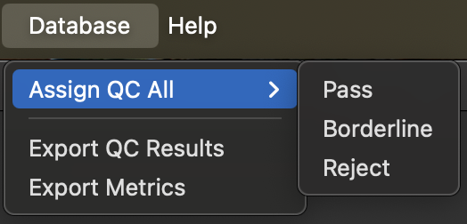

# User Guide

## Getting Started

Ultralyzer is designed to work with retinal UltraWidefield (UWF) images for segmentation and analysis. This guide will walk you through the basic workflow. In a nutshell, you will:

1. Load your image dataset and possibly existing masks.
2. Quality control (QC) the images `{PASS, BORDERLINE, REJECT}`.
3. Run automated segmentation. Only images marked as `PASS` or `BORDERLINE` will be processed.
4. Edit segmentation masks if necessary (most likely).
   - Arteries and veins should be uninterrupted vessel paths. Pay special attention to crossings.
   - The optic disc should be a complete blob (no holes).
   - The fovea should be correctly located at the center of the foveal avascular zone.
   - **Save your edits frequently!**
5. Compute metrics based on the final segmentation masks.
6. Export a results workbook containing metrics and QC data.

⚠️ **Notes** ⚠️

- Masks follow the same naming as the images, except for the extension which will always be `.png` for the masks. For example, if your image is `img_001.tif`, the corresponding mask will also be `img_001.png`.
- Arteries, veins and optic disc are painted in the masks using specific colors (RGB):
  - Arteries **`(255, 0, 0)`** &rarr; red
  - Veins **`(0, 0, 255)`** &rarr; blue
  - Optic Disc **`(0, 255, 0)`** &rarr; green
- An artery & vein crossing should appear as a continuous red and blue path, with no interruptions. Hence, its color at the crossing point will be magenta `(255, 0, 255)`.
- An artery inside the optic disc should appear as yellow `(255, 255, 0)`.
- A vein inside the optic disc should appear as cyan `(0, 255, 255)`.
- A crossing of an artery and a vein inside the optic disc should appear as white `(255, 255, 255)`.
- If masks have been generated using an external tool, images and masks **must** be in two different folders.

## 1. Loading Data

1. **Images**: Go to `File > Open Image Folder...`. Select the directory containing your retinal images (supported formats: PNG, JPG, TIFF, BMP).
2. **Existing Masks**: If you have pre-computed masks, go to `File > Load Segmentation Folder...`. The app will match masks to images by filename.
3. **PSD Segmentations**: Go to `File > Import > PSD Segmentations...`. Select one or more `.psd` files.
   - The application extracts both the image and the mask layers (Arteries, Veins, Optic Disc).
   - If the image is not in the database, it will be added with a QC status of `BORDERLINE` and a note "Imported from PSD, needs review".
   - These images will be saved as `.tif` files in the current image folder or on the default image directory `src/.img`.
   - The masks will be saved as `.png` files in the segmentation folder.
4. **DICOM Images**: Go to `File > Import > DICOM Images...`. Select one or more `.dcm` or `.dicom` files.
   - The application extracts the image from the DICOM file.
   - Images are saved as `.tif` files in the current image folder with the naming convention `PatientID_Laterality_Timestamp.tif`.

---

## 2. Quality Control

Classify images to filter them for analysis:

1. Asses image quality visually based on the following criteria:
   - **Field of View**: Is the retina fully visible?
   - **Illumination**: Is the image well-lit without excessive shadows or glare?
   - **Focus**: Is the image sharp without blurriness?
   - **Artifacts**: Are there any obstructions (e.g., eyelids, eyelashes) or distortions?
   - **Pathology**: Are there any abnormalities that could affect analysis?
2. Add optional **Notes** in the text box.
3. Click a decision button:
    - **✅ PASS**: Good quality, ready for metrics.
    - **⚠️ BORDERLINE**: Usable but has minor issues.
    - **❌ REJECT**: Poor quality and unusable.
4. As soon as you make a decision, the border around the image canvas will change color to reflect your choice.

💡 **Tip** 💡

If you want to bulk assign a QC decision to all images in your folder, go to `Image > Assign QC to All` and select the desired option.

---

## 3. Automated Segmentation

### Automated Segmentation

You can run the AI models directly within the app:

- **Single Image**: Click `⏩ Segment Current` in the bottom panel.
- **Batch Processing**: Click `⏩ Segment All` to process every image in the loaded folder with a QC status `{PASS, BORDERLINE}`.
- **Specific Models**: Use `Analyze > Advanced Segmentation` to run specific tasks like `A/V Segment` or `Disc Segment`.

### Visualization Controls

- **Opacity**: Use the vertical slider on the bottom-left to adjust the transparency of the segmentation overlay (`Ctrl + Scroll`).
- **Channels**: Toggle specific image/overlay views using the dropdown or [shortcuts](./doc_appendix.md#keyboard-shortcuts#view--overlay-controls).

---

## 4. Editing & Correction

If the automated segmentation needs correction, enter **Edit Mode** by clicking `✏️ Edit Mask`.

### Tools

- **🖌️ Brush (`Ctrl+B`)**: Add to the mask.
- **✨ Smart Paint (`Ctrl+Shift+B`)**: Semi-automated painting that sticks to vessel edges.
- **🧹 Eraser (`Ctrl+E`)**: Remove parts of the mask.
- **⇄ Color Switch (`Ctrl+C`)**: Click on a vessel segment to swap it between Artery (Red) and Vein (Blue).
- **🎯 Fovea Location**: Click to manually set the fovea center point.

### Brush Controls

- **Size**: Adjust using the slider or **`+` / `-` keys** (or `Shift + Scroll`).

### Saving Edits

- **Save (`Ctrl+S`)**: Saves the current mask to the disk.
- **Undo/Redo (`Ctrl+Z` / `Ctrl+Shift+Z`)**: Revert or reapply recent changes.

---

## 4. Metric Calculation

Once the segmentation masks are finalized and **saved** (either automatically generated or manually corrected), you can calculate retinal vascular metrics.

### Calculation Controls

- **Single Image**: Click `📊 Metrics` in the bottom panel to calculate metrics for the currently displayed image.
- **Batch Processing**: Click `📊 Metrics All` to calculate metrics for all images in the loaded folder that have a QC status of `{PASS, BORDERLINE}` and a valid segmentation mask.

### What is Calculated?

The software computes a comprehensive set of metrics including:

- **Vessel Geometry**: Width, tortuosity, fractal dimension.
- **Optic Disc**: Area, diameter, shape.
- **Fovea**: Location relative to the optic disc.
- **Artery/Vein Specifics**: Caliber, density, and A/V ratio.

For a full list of calculated metrics and their definitions, please refer to the [Metric Definitions](./doc_appendix.md#metric-definitions).

---

## 5. Exporting Results

Go to `File > Export`:

- **Results Workbook...**: Generates an Excel workbook with a minimal QC sheet, an image-level landmark metrics sheet, and one metrics sheet per ROI.
- **PSD Segmentations**: Exports images and segmentations as layered Photoshop (PSD) files. The PSD file will contain separate layers for `Arteries`, `Veins` and `Optic Disc` segmentation masks as well as the original `Color Image` and its `Green Channel` (for better vessel visibility and discrimation).

   - **Current Image...**: Exports only the currently displayed image and its segmentation mask.
   - **All Images...**: Exports all loaded images with corresponding segmentations.
