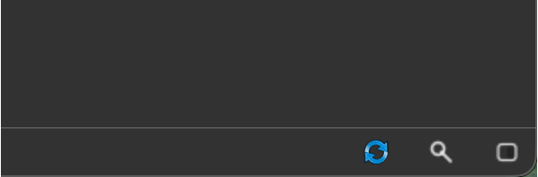

# Workflow Guide

This guide follows the typical Ultralyzer workflow from a new image folder to exported results. It assumes the MATLAB backend path described in [Installation and Setup](./doc_installation.md).

## Workflow overview

1. Load images and any existing masks.
2. Review image quality and save QC decisions.
3. Run segmentation for the current image or pending images.
4. Inspect image channels, overlays, and ROI display.
5. Edit masks and place the fovea if required.
6. Calculate metrics.
7. Export a workbook or PSD files.

:::{tip}
Use the current GUI labels as your guide. If a step mentions **Segment current image** or **Calculate current metrics**, those are the exact buttons shown in the workflow sidebar.
:::

## 1. Load data

### Load images

Use **File > Open Image Folder...** to load the main image directory.

- The folder label in the top navigation row updates immediately.
- The searchable image dropdown is populated with the available files.
- The image filter can then be used to narrow the visible list.

### Load existing segmentations

If you already have masks, use **File > Load Segmentation Folder...**.

- Masks are matched to images by filename.
- Images and masks should live in different folders when masks were generated externally.
- Masks are expected as `.png` files even when the source images use other image formats.

### Import PSD or DICOM data

Use the **File > Import** submenu when you need to ingest external material:

- **PSD Segmentations...** imports layered PSD masks.
- **DICOM Images...** converts supported DICOM files into the project.

## 2. Review image quality

Review the currently displayed image before running batch actions.

1. Inspect focus, illumination, field of view, artifacts, and any pathology that affects analysis quality.
2. Add notes in the **Notes** field when you need image-specific context.
3. Choose one QC decision in the **Review** card:
   - **Pass**
   - **Borderline**
   - **Reject**

Batch processing is intended for the usable images, so this step matters.

:::{tip}
To apply one QC decision to the full filtered set, use **Image > Assign QC to All**.
:::

## 3. Run segmentation

Ultralyzer supports both current-image and pending-image segmentation flows.

### Current image

Use either of these entry points:

- **Segment current image** in the **Current image** card
- **Analyze > Current Image > Segment** in the menu bar

### Pending images

For batch work, use **Analyze > Pending Images > Segment Pending Images**

:::{warning}
You may need to reset your segmentation mask after having saved edits and moved to a different image. In that case, you can re-run Artery/Vein and Optic Disc segmentation independently from **Analyze > Segmentation**.
:::

## 4. Inspect the display before editing

The left sidebar controls how the current image is visualized.

### Image and overlay views

Use the dropdowns to inspect:

- image view: `Color image`, `Red channel`, `Green channel`, `Blue channel`
- mask view: `Arteries`, `Optic disc`, `Veins`, `All vessels`, `All masks`, `No mask`

The number keys documented in [Keyboard shortcuts](./doc_appendix.md#keyboard-shortcuts) are useful when you want to switch overlays quickly.

### Metric ROI

Use **Metric ROI** to decide which ROI definitions are active for display and ROI-dependent metric calculation.

The current default ROI definitions are:

- `Full image`
- `Central retina`
- `Mid-periphery`

When **Show ROI edges** is enabled, the selected ROI combination is drawn on the canvas.

### Canvas overlays

Use these toggles when reviewing a result:

- **Show ROI edges**
- **Show fovea**

The status bar utilities are also useful here. You can find them in the bottom-right corner of the window::

- **Refresh** to reload the image and mask
- **Zoom** for `{fit, actual size, and centering}` controls
- **Opacity** for segmentation mask transparency

## 5. Edit masks when needed

If the segmentation needs correction, click **Edit mask** to enter edit mode.

### Editing goals

During editing, focus on the structures that directly affect metrics:

- keep arteries and veins as continuous vessel paths
- correct artery-vein crossings when the classification is wrong
- keep the optic disc mask complete
- set the fovea location when it is missing or incorrect

### Editing tools

The **Tools** card provides:

- **Brush**: paints directly into the overlay channel you are currently editing. In practice, this means the selected mask view matters. If the overlay is set to `Arteries`, the stroke paints only artery pixels. If it is set to `Optic disc`, it paints only the disc layer. If it is set to `All vessels` or `All masks`, the stroke affects every visible mask channel in that view. If the overlay is set to `No mask`, the stroke is ignored.
- **Smart paint**: follows the stroke path like the brush, but only repaints pixels that already belong to a vessel. It is intended for artery-vein correction, not for drawing new vessel regions from empty background. It only applies when the overlay is set to `Arteries` or `Veins`.
- **Eraser**: removes pixels from the currently active overlay channels. As with the brush, the current mask view determines what is erased. If you erase while viewing `Arteries`, only the artery mask is affected. If you erase while viewing `All masks`, the stroke removes every visible mask channel under that path.
- **Swap**: works with a single click rather than a freehand stroke. Click a vessel region to flood-fill the connected component and switch its artery-vein classification. This is most useful when a continuous vessel segment has been assigned to the wrong vascular class.
- **Fovea location**: click once on the canvas to save the fovea location for the current image. After placing or correcting the fovea, re-run metric calculation so disc-fovea measurements update.
- **Brush size** slider: changes the radius used by **Brush**, **Smart paint**, and **Eraser**. Use a smaller radius for crossings and fine branches, and a larger radius for broad edits.

:::{tip}
When you are editing, first switch the **Mask overlay** dropdown to the specific structure you want to change. That keeps the brush and eraser constrained to the intended layer instead of affecting multiple channels at once.
:::

Use the keyboard shortcuts in [Keyboard shortcuts](./doc_appendix.md#keyboard-shortcuts) to move faster while editing.

### Save and exit

- Use **Save Edits** from the Edit menu or `Ctrl+S`.
- Use **Undo** and **Redo** for correction loops.
- Use **Exit edit mode** when you want to return to the review workflow.

## 6. Calculate metrics

Once the mask and fovea are in a good state, calculate metrics.

### Current image metrics

Run metrics from:

- **Calculate current metrics** in the workflow sidebar
- **Analyze > Current Image > Calculate Metrics** in the menu bar

### Pending image metrics

Use **Analyze > Pending Images > Calculate Pending Metrics** when you want to batch-process the images that Ultralyzer currently treats as pending for metrics.

For this action, an image is considered `pending` when its QC decision is **Pass** or **Borderline**.

- The batch pass recalculates the image-level landmark metrics for those images.
- ROI metrics that already exist for the selected ROI definitions are skipped rather than recomputed.
- If an image still has no saved segmentation, metric calculation for that image will fail, so run segmentation first when needed.

This is different from the **No metrics** image filter, which only shows images that do not yet have saved image-level landmark metrics.

### Geometry readiness matters

Before you calculate metrics, check the geometry readiness dot in the **Current image** card.

- `Green` means geometry-dependent metrics should be available.
- `Yellow` means only part of the geometry workflow is available.
- `Red` means geometry-dependent metrics will be skipped.

This affects measurements such as geodesic distances and area-based metrics. The application stays usable even when those metrics cannot be produced.

:::{note}
If the fovea is missing, Ultralyzer logs a warning and asks you to identify it with the edit-mask workflow before rerunning metrics.
:::

For the current metric families and metric key patterns, see [Metric definitions](./doc_appendix.md#metric-definitions).

## 7. Export results

Use **File > Export** once the dataset is reviewed and processed.

### Results Workbook

This exports the workbook containing QC information, image-level landmark metrics, and ROI-specific metric sheets.

### PSD Segmentations

`PSD` stands for `Photoshop Document`, a layered image format. In this workflow it is useful because Ultralyzer can store the artery, vein, and optic-disc masks as separate editable layers instead of flattening everything into one image.

That makes PSD export a practical handoff format when you want to:

- review the segmentation in external image-editing software
- correct one structure without destroying the others
- keep the original color image and green channel available as aligned reference layers
- import the layered result back through **File > Import > PSD Segmentations...**

:::{tip}
If the user has access to a Tablet/iPad/PC with a stylus, exporting to PSD and editing in [Sketchbook](https://www.sketchbook.com/), or a similar app, can be a more intuitive way to make complex edits than using the brush and eraser tools in Ultralyzer.
:::

This exports layered PSD files containing:

- the original color image
- the green image channel
- artery, vein, and optic-disc segmentation layers

You can export either:

- **Current Image**
- **All Images**

## 8. Recommended daily workflow

For routine use, this sequence tends to work best:

1. Load a folder.
2. Filter to unreviewed images.
3. Save QC decisions.
4. Segment the current image or run pending segmentation.
5. Inspect overlays and ROI settings.
6. Edit masks where needed.
7. Check geometry readiness.
8. Calculate metrics.
9. Export the workbook.
